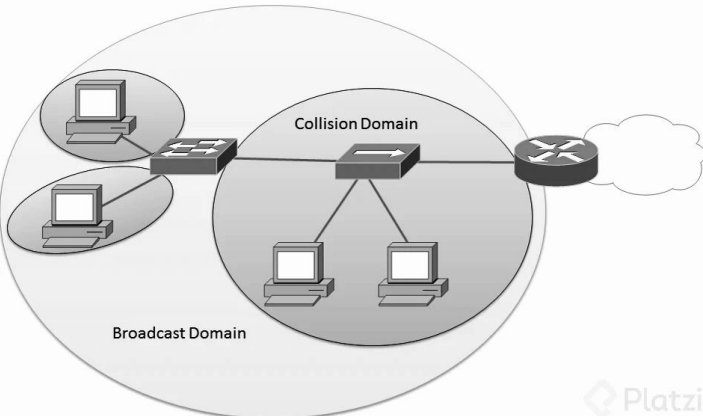
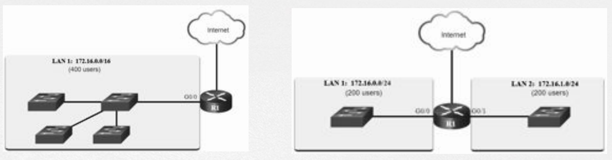

# 🌍 Motivos para la Segmentación de la Red

Las redes deben ser segmentadas para mejorar el rendimiento, la seguridad y la administración del tráfico. Un diseño de red sin segmentación puede generar **congestión**, **latencias elevadas** y **problemas de seguridad**.

---

## 📡 Dominio de Broadcast y su Impacto

Un dominio de broadcast es el conjunto de dispositivos en una red que pueden recibir una transmisión de broadcast enviada por cualquier otro dispositivo dentro de ese dominio.

Cuando una red no está segmentada, todos los dispositivos reciben las transmisiones de broadcast, lo que genera **mayor tráfico innecesario** y puede afectar el rendimiento de la red.

📌 **Ejemplo visual**:

✔ **Problema**: Todos los dispositivos reciben el tráfico de broadcast.  
✔ **Consecuencia**: Aumento de la congestión en la red, lo que ralentiza la comunicación y afecta el desempeño general.  

---

## 🔀 Segmentación de los Dominios de Broadcast

La segmentación de los dominios de broadcast permite dividir una red en subredes más pequeñas, reduciendo el tráfico innecesario y mejorando la eficiencia.

📌 **Ejemplo de segmentación**:

✔ **Antes de segmentar**: Un único dominio de broadcast donde todos los dispositivos reciben el tráfico de broadcast.  
✔ **Después de segmentar**: Separación en varias subredes que reducen el impacto del tráfico de broadcast y mejoran el rendimiento de la red.  

---

## ⚠️ Consecuencias de no segmentar correctamente

🔴 **Latencia elevada**: Cuando hay demasiados dispositivos en un solo dominio de broadcast, el tráfico de broadcast ocupa ancho de banda y genera retrasos.  
🔴 **Mayor vulnerabilidad a ataques**: Sin segmentación, un atacante puede propagar amenazas con mayor facilidad dentro de la red.  
🔴 **Red menos escalable**: Una red sin segmentación crece desordenadamente, dificultando su gestión y mantenimiento.  

---

## ✅ Beneficios de la Segmentación

✔ **Mejor rendimiento**: Reduce el tráfico innecesario y mejora la velocidad de la red.  
✔ **Mayor seguridad**: Permite aislar grupos de dispositivos, dificultando ataques y propagación de malware.  
✔ **Facilidad de administración**: Al dividir la red en segmentos más pequeños, se pueden aplicar políticas específicas y gestionar mejor el tráfico.

---

📌 **Conclusión**: La segmentación de la red es fundamental para mejorar la eficiencia, seguridad y escalabilidad. Técnicas como **subneteo**, **VLANs** y el uso de **routers** permiten optimizar la estructura de la red y evitar los problemas generados por dominios de broadcast grandes.

